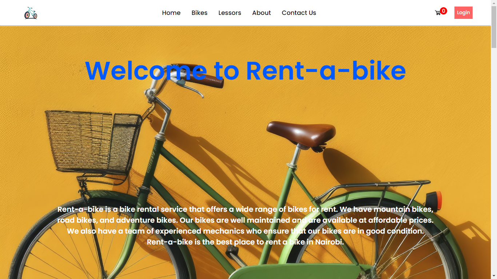
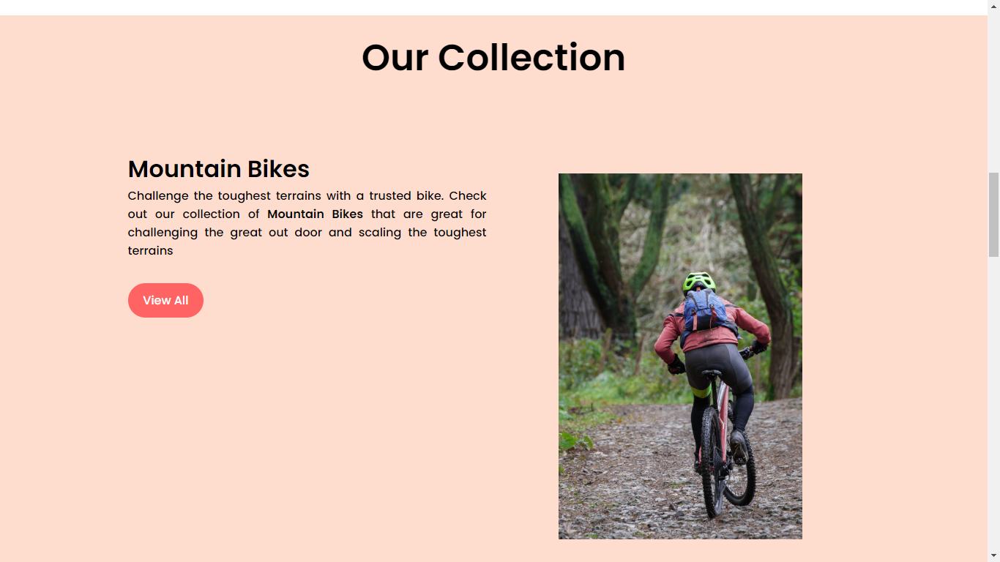
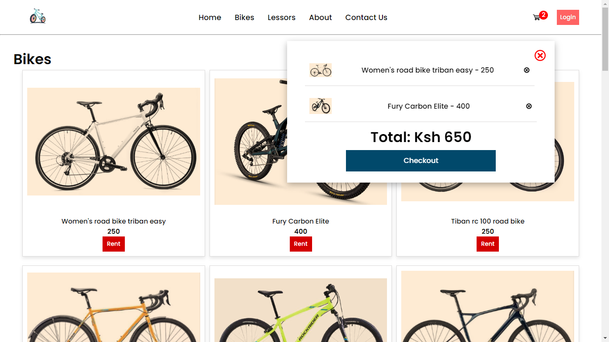
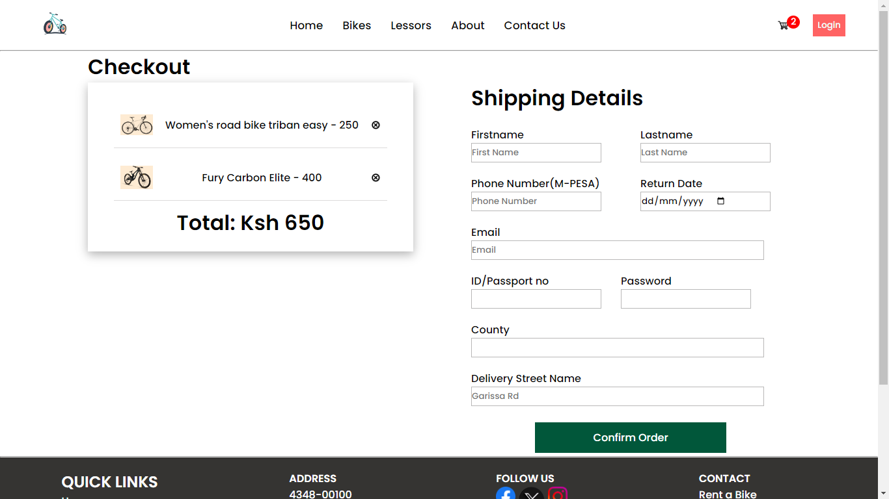

### **RENT-A-BIKE** PROJECT



**Deployed Site** - [rent-a-bike](http://bravinonwonga.tech/bikes)
**Landing Page** - [mainpage](http://bravinonwonga.tech/home)
**LinkedIn** - [Bravin Onwonga](https://www.linkedin.com/in/bravin-onwonga-913296239/)
**Blog Post** - [Rent-a-Bike Blog](https://medium.com/@onbravin/rent-a-bike-want-to-cycle-9201ff16e09e)

### Description
Cycling is not an easy option in most cities for those looking to do it in the short term or long term. Rent-a-Bike aims to address especially the difficulty in getting a bicycle one can use. We offer a wide range to choose from and handle the process of delivery which can be cumbersoe and to some impossible.

### How to get this on your computer :computer:
- Clone the project
- Ensure you have python installed and add its path to the environment
- Activate your python environment
- Run the following commant to install all ```dependencies```
> pip install -r requirements.txt
- Include your information for the M-Pesa api in the ```.env``` file. Sign up for an account [here](https://developer.safaricom.co.ke/)
- Run ```python3 -m api.v1.app``` to run the app server locally and ```python3 -m web_dynamic.index``` to run the web server.

### More Screenshots


**Cart Page**


**Checkout Page**


### AUTHOR :eyeglasses:
- **Bravin Onwonga** - [Profile](https://github.com/bravin-onwonga)

### License :lock:
This project is licensed under the MIT License - see the [LICENSE](./LICENSE) file for details.

[](https://github.com/standard/semistandard)
